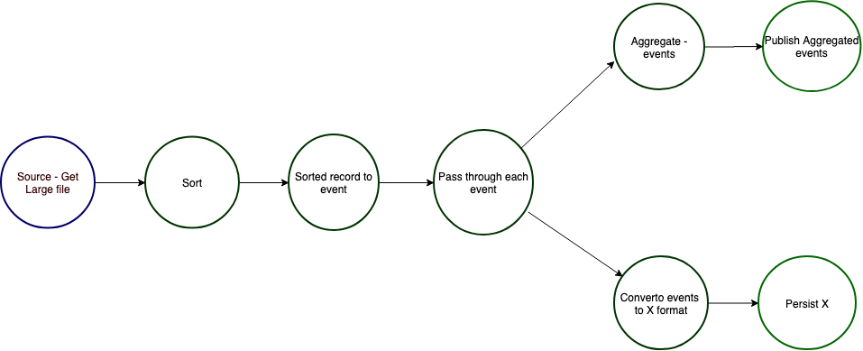

# dataflow-pipeline - Dataflow pipeline of bounded stream

## Summary

Supposed to process bounded set of data in streamed fashion through various 
steps defined in pipeline workflow. Process can be transformation from X to Y.
This is supposed to run on single host.

### Dataflow pipeline
 
  Allows to create pipeline, a pipeline can be considered
  as a directed tree with root node as source of the data and leaf nodes as sink.
  Intermediate nodes can be thought of 
  transformers and edges represent data or stream of data. 
  One can provide own pipeline definition by implementing interface 
  `com.mozafaq.dataflow.pipeline.PipelineCreateAware`.
  
  A source, transformer and a sink objects can be created by 
   implementing below interfaces.
   - **`com.mozafaq.dataflow.pipeline.PipelineSource`**: Similar to
   `Transform` except this is the beginning og the pipeline.
   If you want pipeline to receive `onBegin` and `onComplete` event then you must 
   call being and end event before and  after processing source.
    
   - **`com.mozafaq.dataflow.pipeline.Transformer`**: This has below APIs 
   and their purposes
      - `onBegin`: Called only once in the beginning, optional to implement. If you 
      implement it it must call `pipelinechain.onBegin()` so that underlying 
      pipeline flow can get onBegin event.
      - `transform`: This is where actual logic reside. This should call 
      `chain.output` for sending output for subsequent processing.
      - `onComplete`: Called only once in the beginning, optional to implement. If you 
      implement it it must call `pipelinechain.onComplete()` so that underlying 
      pipeline flow can get onComplete event.
      
   - **`com.mozafaq.dataflow.pipeline.PipelineSink`**:
     Similar to `Transformer` except that this is last in the pipeline therefore you don't
      have option to sent event further down in the pipeline.
    
  An example graph of pipeline can be seen as below
  
  
  
  
  This pipeline does followings
   1. Gets the large file
   1. Sort the file
   1. Read the record on-by-one from sorted file and convert into event
   1. Events are forwarded to two path -> Aggregation and Conversion
   1. Aggregator aggregate record and Converter convert the events into different format
   1. Aggregated record is published at some place
   1. Converted records are persisted
  
 
## Build

 ```mvn clean insall```

## Contributors
 - Mozaffar Afaque